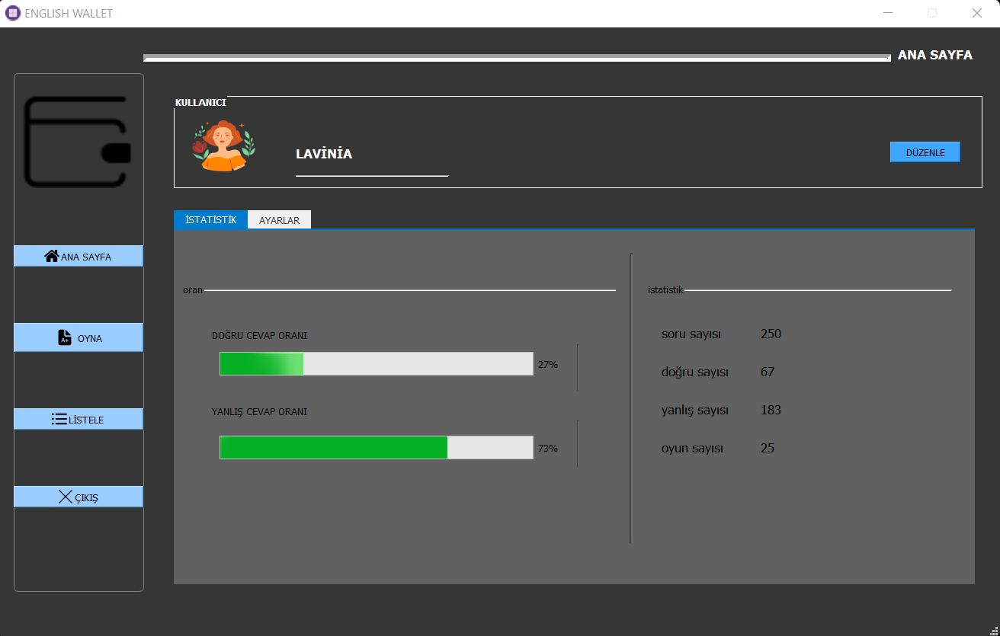
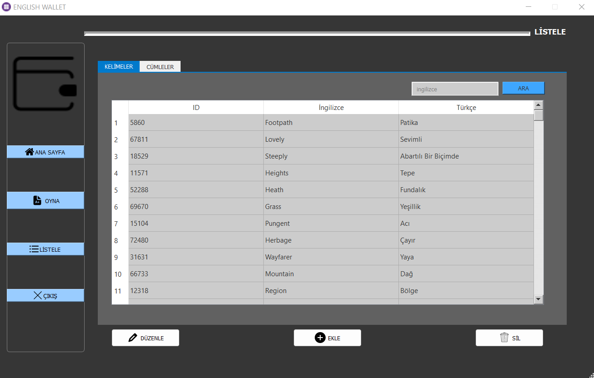
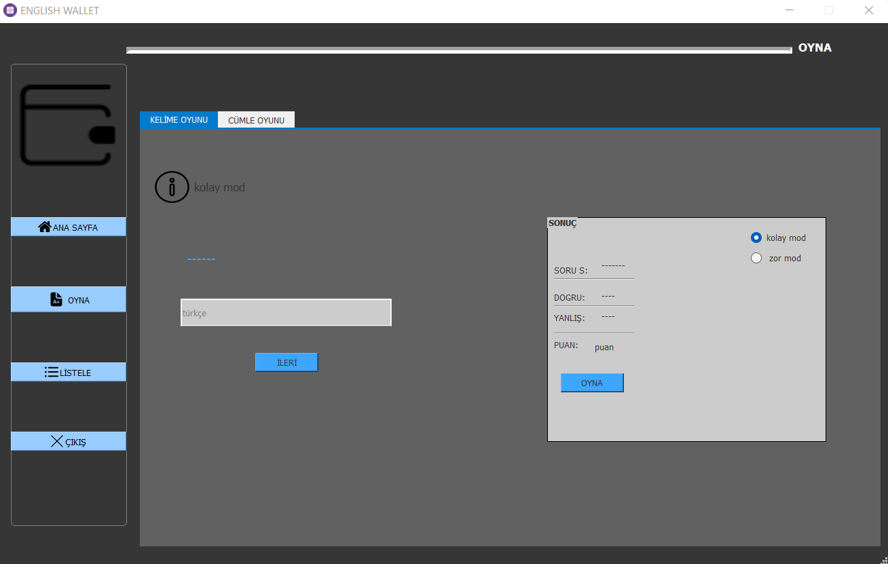

# **English-Wallet**     

Turkish English-Turkish word and sentence pairs of this desktop application, users can answer the questions asked and keep the success statistics. In addition, users can add, edit and delete pairs of words and sentences. They can also edit user profiles. It allows you to repeat, work on word or sentence structures that are difficult to repeat.

## Features

 Turkish English-Users can add, edit and delete English-Turkish word and sentence pairs.
- Users are asked questions over the data in the db.
- The application tracks and shows users' success statistics.
- Users can edit their profile information.
- The interface is designed in a user-friendly and easy-to-use way.

#

## Utilization
  - When the application starts, the main screen will appear in front of you.
  - you can access the homepage, play and edit pages.
  - by clicking on the "play" button, you will see word and sentence games when you say play, the 10-question test starts. Think about the Turkish equivalent and check your answer by clicking on the "Reply" button.
  - Go to the "homepage" page to keep track of your success statistics.
  -on the "homepage" page, you can edit your user information, view game statistics, or delete data from the settings section.
  - you can view pairs of words and sentences from the "edit" page and make additions, edits and deletions.

#
<table>
  <tr>
    <td>
      
    </td>
    <td>
      
    </td>
  </tr>
</table>

it's been a project that I've really been working on with love, if there's anything you want me to add, please let me know it gives me excitement to be in touch with you on such issues.  :)

## Contact

**If you have any questions or suggestions, please [a problem via GitHub (issue)](https://github.com/52h44a34l/English-Wallet/issues ) open.**

#

